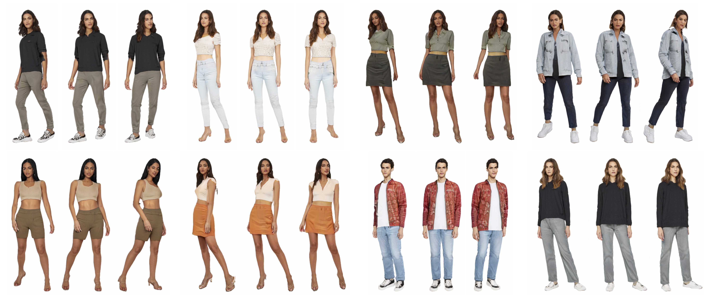

# 3DHumanGAN: Towards Photo-realistic 3D-Aware Human Image Generation


[Zhuoqian Yang](https://yzhq97.github.io/), [Shikai Li](mailto:lishikai@sensetime.com), [Wayne Wu](https://wywu.github.io/), [Bo Dai](https://daibo.info/) <br>
**[[Video Demo]](https://www.youtube.com/watch?v=fYgVYGMLpnw)** | **[[Project Page]](https://3dhumangan.github.io/)** | **[[Technical Report]](https://arxiv.org/abs/2212.07378)**

**Abstract:** *We present 3DHumanGAN, a 3D-aware generative adversarial network (GAN) that synthesizes images of full-body humans with consistent appearances under different view-angles and body-poses. To tackle the representational and computational challenges in synthesizing the articulated structure of human bodies, we propose a novel generator architecture in which a 2D convolutional backbone is modulated by a 3D pose mapping network. The 3D pose mapping network is formulated as a renderable implicit function conditioned on a posed 3D human mesh. This design has several merits: i) it allows us to harness the power of 2D GANs to generate photo-realistic images; ii) it generates consistent images under varying view-angles and specifiable poses; iii) the model can benefit from the 3D human prior. Our model is adversarially learned from a collection of web images needless of manual annotation.* <br>


## TODOs
- [x] Release technical report.
- [ ] Release code and pretrained models.
- [ ] Implement huggingface demos.
- [ ] Implement EG3D backend.

## Related Works
* (ECCV 2022) **StyleGAN-Human: A Data-Centric Odyssey of Human Generation**, Jianglin Fu et al. [[Paper](https://arxiv.org/pdf/2204.11823.pdf)], [[Project Page](https://stylegan-human.github.io/)], [[Dataset](https://github.com/stylegan-human/StyleGAN-Human)]

## Citation

If you find this work useful for your research, please consider citing our paper:

```bibtex
@article{yang20223dhumangan,
    title={3DHumanGAN: Towards Photo-realistic 3D-Aware Human Image Generation}, 
    author={Yang, Zhuoqian and Li, Shikai and Wu, Wayne and Dai, Bo},
    journal   = {arXiv preprint},
    volume    = {arXiv:2212.07378},
    year    = {2022}
}
```

